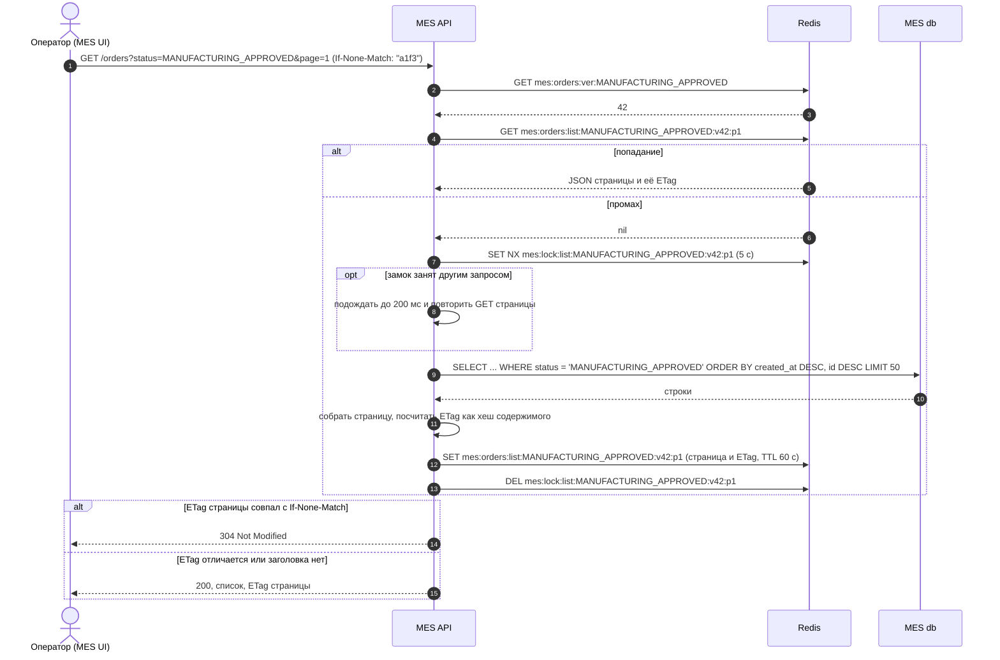
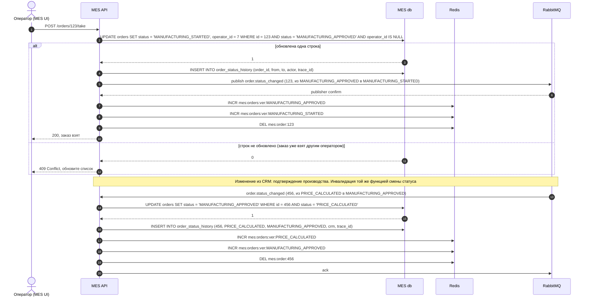
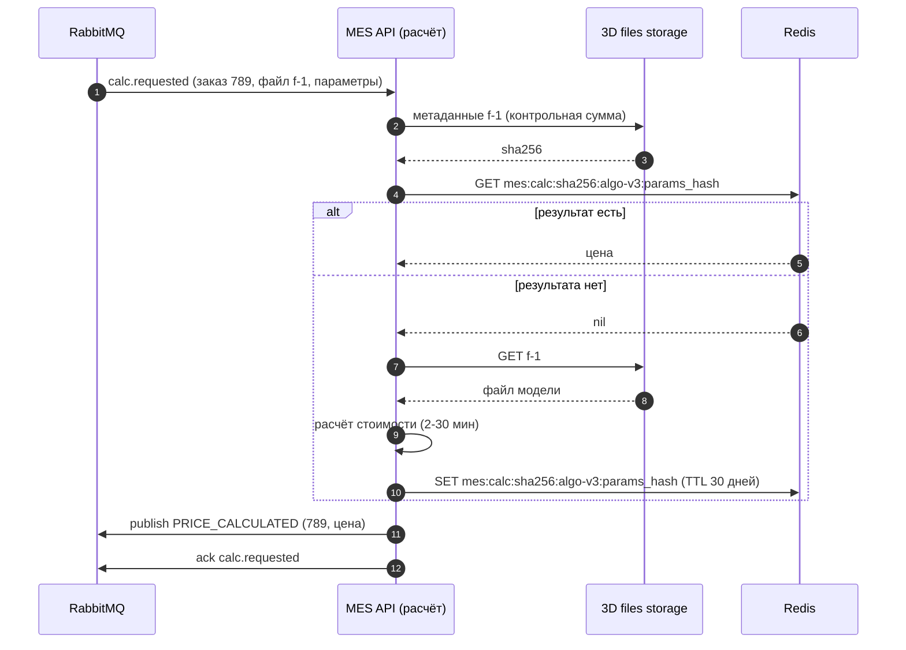

# Архитектурное решение по кешированию

Документ для бизнеса и разработчиков: что и зачем кешировать в MES, каким способом и как поддерживать кеш в актуальном состоянии. В процессе разработки документ используется как справочный: здесь зафиксировано, почему выбраны именно такие паттерн и стратегия инвалидации.

Три диаграммы последовательности приведены в тексте (Mermaid, GitHub отрисовывает их сам) и продублированы картинками в папке [diagrams](diagrams); диаграмма альтернативного решения из раздела 5 дана только картинкой.

## 1. Анализ: какую часть системы имеет смысл кешировать

Симптомы: первая страница MES (дашборд с заказами в работе по статусам, фильтром и пагинацией) загружается долго; операторы обновляют её постоянно, потому что от скорости зависит, кто возьмёт новый заказ; новых клиентов не устраивает скорость выполнения заказа, а расчёт стоимости занимает от 2 до 30 минут и делит CPU единственного инстанса MES API с обслуживанием дашборда.

Профиль нагрузки на дашборд:

| Свойство | Значение | Вывод |
| --- | --- | --- |
| Читатели | Все операторы одновременно, каждый обновляет страницу раз в несколько секунд | Десятки одинаковых запросов в минуту на одни и те же данные |
| Изменения | Смена статуса заказа: единицы в минуту (действия операторов, сообщения из CRM) | Чтений на порядки больше, чем записей |
| Множество запросов | Статус (фиксированный набор), сортировка «новые сверху», первые одна-две страницы | Небольшой набор «горячих» ключей |
| Допустимая устаревшесть | Секунды. Операторам важно видеть новые заказы быстро, но взятие заказа всё равно проверяется базой | Кеш с коротким сроком жизни и принудительной инвалидацией при изменении |

Что кешировать:

1. **Список заказов по статусу** (первые страницы, отсортированные по дате создания) и **счётчики заказов по статусам** для вкладок дашборда. Это основная цель.
2. **Карточку заказа** (детали, модель, история статусов), которую операторы открывают из списка. Меняется редко.
3. **Результат расчёта стоимости** по контрольной сумме файла модели и параметрам заказа. Расчёт детерминирован: та же модель и те же параметры дают ту же цену. Повторные отправки моделей партнёрами и пересчёт после правок заказа не должны занимать минуты CPU повторно. Это прямое влияние на скорость выполнения заказов новых клиентов.
4. Справочники (статусы, операторы, материалы): дёшево и полезно, но не влияет на проблему.

Что кешировать нельзя: операцию «взять заказ» и любые записи статусов. Они должны проходить через базу с проверкой условий, иначе двое операторов возьмут один заказ.

Кеш не отменяет работу с базой: составной индекс `(status, created_at DESC)` и keyset-пагинация вместо `OFFSET` нужны в любом случае, иначе промах кеша будет стоить столько же, сколько сейчас стоит каждый запрос. Кеш снимает с базы повторяющиеся одинаковые запросы и делает ответ операторам стабильным по времени.

## 2. Мотивация

Зачем внедрять кеширование:

- Дашборд операторов: ответ из Redis занимает единицы миллисекунд вместо запроса к таблице заказов при каждом обновлении. Нагрузка на MES db от дашборда падает практически до частоты изменений статусов.
- Меньше конкуренции с расчётами: пока расчёт стоимости не вынесен в отдельный сервис, каждый сэкономленный запрос к базе и каждая сэкономленная миллисекунда CPU на MES API уменьшают взаимное влияние дашборда и расчётов.
- Повторные расчёты: кеш результатов по хешу модели убирает повторную работу на минуты и ускоряет ответ партнёрам и магазину.
- Готовность к масштабированию: общий кеш в Redis работает одинаково для одного и для нескольких экземпляров MES API, которые появятся по плану отказоустойчивости.

Какие проблемы решает: медленная первая страница MES (жалобы операторов), нагрузка на MES db и MES API, повторные расчёты одинаковых моделей.

Какие элементы системы включаются в кеширование: MES API (код чтения списка, счётчиков и карточки, код смены статусов и обработчик сообщений из CRM, код расчёта стоимости), новый компонент Redis (managed-сервис Yandex Cloud, сейчас он поставляется как Valkey, совместимый с Redis), MES db как источник данных, 3D files storage как источник контрольной суммы файла.

## 3. Предлагаемое решение

### 3.1. Клиентское или серверное кеширование

Выбрано **серверное кеширование** в Redis с небольшим дополнением на клиенте.

Клиентское кеширование (в браузере оператора) не решает задачу: оно экономит запросы только одного оператора, а нагрузка создаётся десятками операторов, которые запрашивают одно и то же. Кроме того, актуальность списка должна быть общей для всех операторов: если у одного список свежий, а у другого пятиминутной давности, второй будет пытаться брать уже занятые заказы.

Серверный кеш находится между MES API и базой, поэтому одинаковые запросы всех операторов обслуживаются одним результатом, инвалидация происходит в одном месте, и он продолжает работать при нескольких экземплярах MES API. Выбран Redis как managed-сервис: TTL на ключах, атомарные операции (`INCR`, `SET NX`), доступ из всех экземпляров, отсутствие сопровождения.

Дополнение на клиенте: ответ списка возвращается с заголовком `ETag` (хеш содержимого страницы, он хранится в Redis вместе со страницей), а браузер отправляет `If-None-Match`. Если страница, взятая из кеша или перечитанная из базы, совпала с той, что уже есть у клиента, сервер отвечает `304 Not Modified` без тела. Сравнение идёт по содержимому, поэтому перечитывание страницы после истечения TTL корректно обновляет `ETag`. Это уменьшает трафик при постоянных обновлениях страницы, но не влияет на согласованность, потому что источником остаётся сервер. Статические файлы приложения MES отдаются с длительным `Cache-Control` через CDN или балансировщик.

### 3.2. Паттерн: Cache-Aside

Для списка, счётчиков и карточки заказа применяется **Cache-Aside**: MES API сначала спрашивает Redis; при промахе читает базу, кладёт результат в Redis с TTL и отдаёт оператору. При изменении статуса заказа MES API инвалидирует затронутые ключи, и следующий запрос перечитывает базу.

Для результатов расчёта тот же паттерн, где источником данных является сам расчёт: проверить кеш по ключу из контрольной суммы файла, версии алгоритма и параметров; при промахе посчитать и сохранить результат на 30 дней.

Почему не Write-Through. При Write-Through каждая запись синхронно обновляет и базу, и кеш. Но кешируемые списки представляют собой результаты запросов, а не объекты: одна смена статуса меняет два списка (старого и нового статуса), несколько страниц и два счётчика. Пересобирать их синхронно на каждой записи означает выполнять тяжёлые запросы на пути записи, в том числе для статусов, на которые сейчас никто не смотрит. Запись становится медленнее и зависит от доступности Redis. Для карточки заказа Write-Through возможен, но не даёт преимуществ перед удалением ключа.

Почему не Refresh-Ahead. Набор горячих ключей известен и небольшой, поэтому фоновое обновление списков каждые несколько секунд технически возможно. Но оно выполняет запросы к базе постоянно, даже ночью и даже для статусов без читателей, требует планировщика с выбором лидера при нескольких экземплярах MES API и даёт окно устаревания, равное интервалу обновления, которое не сокращается при событии. Этот вариант рассмотрен как альтернатива в разделе 5 и уместен, если промахи кеша станут заметной нагрузкой.

Ключи в Redis:

| Ключ | Содержимое | TTL |
| --- | --- | --- |
| `mes:orders:ver:{status}` | Номер версии списка для статуса, увеличивается при любом изменении, затрагивающем статус | без TTL |
| `mes:orders:list:{status}:v{ver}:p{page}` | JSON страницы списка (первые 3 страницы по 50 заказов) и её `ETag` | 60 с |
| `mes:orders:count:{status}:v{ver}` | Число заказов в статусе | 60 с |
| `mes:order:{id}` | Карточка заказа | 300 с |
| `mes:calc:{sha256(file)}:{algo_version}:{params_hash}` | Результат расчёта стоимости | 30 дней |
| `mes:lock:{ключ списка}` | Замок на время заполнения кеша (защита от «стада» при промахе) | 5 с |

Версия в ключе нужна для дешёвой инвалидации: вместо поиска и удаления всех страниц списка (`SCAN` по шаблону, дорогая операция) достаточно увеличить версию (`INCR`), а старые страницы умрут по TTL. Объём данных небольшой: около десяти статусов, по три страницы, десятки килобайт на страницу; Redis на 1-2 ГБ памяти достаточно с большим запасом, включая кеш результатов расчётов.

### 3.3. Диаграммы последовательности

Чтение списка заказов (промах и попадание):

Статичная версия диаграммы: [read-order-list.png](diagrams/read-order-list.png).

Запись об изменении статуса: оператор берёт заказ в работу, затем изменение статуса приходит из CRM через очередь. Оба пути инвалидируют кеш одним и тем же кодом.

Статичная версия диаграммы: [status-change.png](diagrams/status-change.png).

Кеш результатов расчёта стоимости:

Статичная версия диаграммы: [calc-result-cache.png](diagrams/calc-result-cache.png).

Сущности, участвующие в кешировании: оператор и MES UI (читатель, передаёт `If-None-Match`), MES API (владелец логики кеша: чтение, заполнение, инвалидация, замок), Redis (хранилище кеша: версии, страницы, счётчики, карточки, результаты расчётов, замки), MES db (источник данных для списков и карточек), RabbitMQ и CRM API (источник внешних изменений статусов, которые тоже инвалидируют кеш), 3D files storage (источник контрольной суммы и файла для кеша расчётов).

История статусов в MES db относится к производственной части процесса (MES и так хранит статусы со своей точки зрения); сквозной журнал заказа по всем системам ведёт CRM API на основе сообщений, как описано в решении по трейсингу. Публикация в RabbitMQ на диаграмме показана упрощённо: по плану надёжной интеграции запись в outbox выполняется в той же транзакции, что и обновление заказа, а отправку в брокер делает фоновый процесс. На инвалидацию кеша это не влияет.

Гонки и согласованность. Список может показать заказ, который секунду назад взял другой оператор. Это допустимо: операция «взять» проверяется в базе условным `UPDATE`, а оператор получает `409` и свежий список. Согласованность обеспечивает база, кеш отвечает только за скорость. Промах при истёкшем TTL под нагрузкой (несколько операторов одновременно) ограничен замком `SET NX`: базу спрашивает один запрос, остальные ждут до 100-200 мс и читают из кеша. Недоступность Redis не останавливает работу: клиент кеша настроен с коротким таймаутом и при ошибке MES API идёт в базу напрямую, а метрика ошибок кеша даёт алерт.

### 3.4. Стратегия инвалидации

Выбрана **инвалидация по ключу, запускаемая программно при изменении данных** (увеличение версии статуса и удаление карточки в момент смены статуса), с **временной инвалидацией (TTL) как страховкой**.

| Критерий | Инвалидация по ключу при изменении (выбрана) | Только временная (TTL) | Программная по расписанию (полная очистка) | Инвалидация по событиям из очереди |
| --- | --- | --- | --- | --- |
| Подходит, потому что | Все изменения статусов проходят через код MES API (действия операторов и обработчик сообщений CRM), поэтому момент изменения известен точно. Версия в ключе делает инвалидацию операцией O(1) без поиска ключей | Проста, не требует кода в местах записи | Проста | Не привязана к коду записи |
| Особенности | 1) Нужно не пропустить ни одно место записи; помогает единая функция смены статуса. 2) Старые страницы живут до TTL, но недоступны, потому что версия ушла вперёд | Новый заказ виден операторам с задержкой до TTL. Чем короче TTL, тем меньше польза кеша | Очищает и то, что не менялось; в момент очистки промах у всех операторов сразу | В MES изменения приходят и из UI, и из очереди; событийная инвалидация нужна только для внешних изменений, и она уже включена в выбранную стратегию (обработчик сообщений вызывает ту же функцию) |
| Позволяет сделать | Свежий список сразу после изменения при попадании в кеш в остальное время; `ETag` для клиента | Ничего сверх базовой экономии | Периодический сброс накопленных ошибок | Инвалидацию из других систем без прямого доступа к Redis |
| Не позволяет сделать | Учесть изменения, сделанные напрямую в базе в обход MES API (миграции, ручные правки). Для этого остаётся TTL 60 с | Гарантировать актуальность в пределах TTL, что критично для взятия новых заказов | Тонкую инвалидацию | Обработать изменения, которые не порождают события |

Итог: программная инвалидация по ключу с версиями закрывает основной сценарий (оператор видит новый заказ сразу после подтверждения в CRM), TTL 60 секунд для списков и 5 минут для карточек закрывает редкие изменения в обход кода, а для результатов расчётов достаточно длинного TTL, потому что ключ включает версию алгоритма и результат не устаревает.

## 4. Метрики и проверка результата

- Доля попаданий в кеш по типу ключа (цель более 90 % для списков в рабочее время).
- p95 ответа `GET /orders` (цель менее 200 мс при текущем объёме).
- Число запросов к MES db от дашборда в минуту до и после внедрения.
- Доля расчётов, взятых из кеша, и сэкономленное время CPU.
- Ошибки и таймауты Redis, число `409` при взятии заказа (косвенно показывает устаревание списков).

Порядок внедрения: индекс и keyset-пагинация (1 день), Managed Redis (DevOps, 1 день), Cache-Aside для списка и счётчиков с версиями (C#, 3 дня), карточка заказа и `ETag` (2 дня), кеш результатов расчёта (2 дня), метрики и алерты (1 день). Сначала release-окружение с нагрузочной проверкой сценария «20 операторов обновляют список каждые 3 секунды».

## 5. Дополнительное задание: сравнение двух решений

| | Решение 1: Cache-Aside с инвалидацией по версии ключа | Решение 2: Refresh-Ahead, фоновая сборка снимков дашборда |
| --- | --- | --- |
| Описание | MES API читает Redis, при промахе читает базу и заполняет кеш; смена статуса увеличивает версию списка. Диаграммы в разделе 3.3 | Фоновая задача в MES API (один экземпляр-лидер) каждые 5 секунд и по событию смены статуса пересобирает первые страницы всех статусов и счётчики и кладёт их в Redis без TTL. Запросы операторов всегда читают снимок и никогда не ходят в базу. Диаграмма: [refresh-ahead.png](diagrams/refresh-ahead.png) |
| Плюсы | Кешируется только то, что читают; нет фоновой нагрузки на базу; актуальность сразу после изменения; простая логика без планировщика и лидера; штатное поведение при отказе Redis (запросы идут в базу) | Стабильное время ответа без промахов даже при всплеске операторов; база получает предсказуемую нагрузку (один пересбор в интервал); нет «стада» на промахе; при отказе базы дашборд продолжает показывать последний снимок |
| Минусы | Первый запрос после изменения ждёт базу (промах); при одновременном истечении TTL нужен замок; при недоступности Redis нагрузка на базу возвращается к сегодняшней | Пересборка идёт постоянно, в том числе без читателей; окно устаревания до 5 секунд, если событие пропущено; нужен выбор лидера при нескольких экземплярах MES API, иначе несколько экземпляров пересобирают одно и то же; больше кода и больше мест, где можно ошибиться; фильтры и страницы вне снимка всё равно нужно обслуживать по первому решению |

Заключение. Для текущего масштаба (десятки операторов, единицы изменений в минуту) подходит **решение 1**: оно проще, не создаёт постоянной нагрузки на базу и даёт свежий список сразу после изменения, что важно операторам. Решение 2 стоит вернуть в рассмотрение, если число операторов вырастет в разы и промахи после каждой смены статуса станут заметной нагрузкой, либо если потребуется показывать дашборд при недоступности базы. Оба решения совместимы: снимок для первой страницы можно добавить поверх решения 1 позже, не меняя ключей и логики инвалидации.
